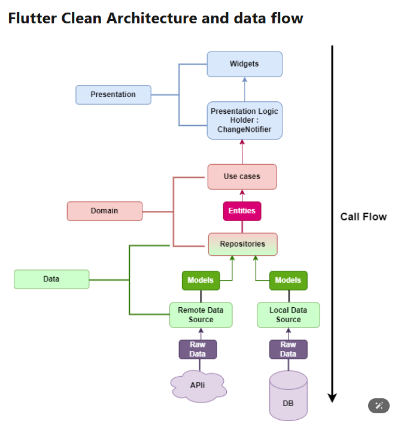

# `Clean Architecture`

## Tổng quan về `Clean Architecture`: 
- sử dụng để chia ứng dụng thành các tầng (`layers`) riêng biệt với các nguyên tắc sau 
    
    + `Tách biệt trách nghiệm`: mỗi tầng chỉ đảm nghiệm một chức năng cụ thể 
    + `Nguyên tắc phụ thuộc` (dependency rule): `các tầng bên trong (nội tại) không phụ thuộc vào các tầng bên ngoài (ngoại tại)`, mà chỉ có chiều ngược lại  
    + `Tính độc lập`: tầng lõi (`domain`) không phụ thuộc vào `framework, cơ sở dữ liệu hay giao diện` 

- Trong `flutter`, `Clean Architecture` thường được chia thành ba tầng chính: 
    
    +`Presentation Layer` (tầng trình bày): chứa giao diện người dùng (`UI`) và `logic hiển thị ` 
    + `Domain Layer` (tầng miền): chứa `logic nghiệp vụ cốt lõi`, `độc lập` với bất kỳ công nghệ nào 
    + `Data Layter` (tầng dữ liệu): quản lý dữ liệu từ các nguồn như `API`, `CSDL cục bộ`

## Clean Architecture Flow   

### Từ trên xuống dưới (`Presentation` -> `Domain` -> `Data`): khi người dùng tương tác với ứng dụng và yêu cầu dữ liệu

1. `người dùng` tương tác với `Widgets` (như nhấn nút "Lấy dữ liệu")
2. `Widgets` thông báo cho `Presentation Logic Holder`/`BlocC`
    - `Presentation Logic Holder (ChangeNotifier)`: là nơi chứa logic giao diện và quản trị lý trạng thái (`state`) của giao diện. 
    - có thể sử dụng `BloC` thay cho `Presentation Logic Holder (ChangeNotifier)`, `BloC` dựa trên luồng sự kiện `Event` và trạng thái `State`
        + `Event`: Đại diện cho các hành động từ người dùng hoặc hệ thống 
        + `State`: đại diện cho trạng thái của giao diện (đang tải, hiển thị dữ liệu, lỗi,...)
        + `BloC`: là một lớp trung gian nhận các `Event`, xử lý logic (gọi `UseCase`), và phát ra các `State` để giao diện `Widgets` cập nhật.
3. `Presentation Logic Holder`/`BloC` gọi các `Use Case` trong tầng `Domain` 
    - `Use Case`: chứa logic nghiệp vụ cốt lõi và gọi `Repositories` để lấy dữ liệu, nó chỉ là một phương thức trừu tượng

4. `Use Case` gọi `Repositories` để lấy dữ liệu
    - `Repositories` là tầng trung gian giữ `Domain` và `Data`, cung cấp cho giao diện trừu tượng để `Use Case` để lấy dữ liệu mà không cần biết chi tiết cách dữ liệu được lấy 
    - `Repositories` được định nghĩa dưới dạng một giao diện `interface` hoặc `abstract class`
    - `Quy trình:`
        + `UseCase` gọi phương thức của `Reponsitory`, `Reponsitory` đóng vai trò cầu nối, đảm bảo tầng `Domain` không phụ thuộc vào chi tiết kỹ thuật của tầng Data

5. `Repositories` giao tiếp với `Remote Data Source` hoặc `Local Data Source` để lấy dữ liệu thô (`Raw Data`)
    - `Remote Data Source`: xử lý lấy dữ liệi từ nguồn xa, thường là API 
    - `Local Data Source`: xử lý dữ liệu từ nguồn cục bộ, như CSDL 
    - `Raw Data`: là dữ liệu chưa xử lý, thường ở dịnh dạng JSON (từ API) hoặc bản ghi từ db 
    - `Quy trình:` 
        + `Reponsitory` triển khai `interface` bằng cách gọi `RemoteDataSource` hoặc `LocalDataSource` tùy vào nguồn dữ liệu 
        + `Raw Data` được lấy về và chuẩn bị để chuyển đổi

6. Dữ liệu thô được chuyển thành `Models`, rồi thành `Entities` để trả về cho `use case`
    - `Models` là các class đại diện cho cấu trúc `CSDL` thô 
    - `Entities` là các đối tượng từ tầng `Domain`, đại diện cho dữ liệu `cốt lõi`. `Entities` khác với `Models` vì chúng không chứa `logic kỹ thuật` và chỉ tập trung vào nghiệp vụ
    - `Quá trình chuyển đổi:`
        + `Raw Data` -> `Models` (chuyển đổi `JSON` thành đối tượng `Dart`)
        + `Models` -> `Entities` (ánh xạ dữ liệu từ `Models` sang `Entities`, thường qua một lớp mapper)
    - `Quy trình: `
        + `Remote/Local Data Source` trả dữ liệu thô cho `Reponsitory` 
        + `Repository` chuyển đổi dữ liệu thô (`Raw`) thành `Models` sau đó ánh xạ sang `Entities` 
        + `Entities` được trả về cho `Use Case`, rồi ngược lên `BloC` và cuối cùng đến `Widgets` 

7. Luồng ngược lại (`Dữ liệu trả về`)
    - Sau khi `Entities` được tạo, luồng dữ liệu quay ngược lại 
        + `Use Case` trả `Entities` cho `Presentation Logic Holder / BlocC` 
        + `Presentation Logic Holder/ BloC` xử lý (nếu cần) và phát ra trạng thái mới 
        + `Widgets` nhận trạng thái và cập nhật giao diện để hiển thị dữ liệu cho người dùng
        